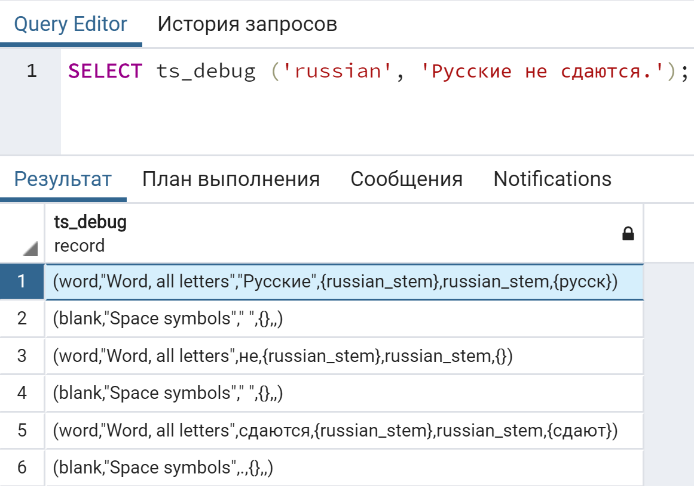

# Использование FTS в PostgreSQL
#### 1. Тип tsvector
Выполните запрос
```sql
SELECT to_tsvector('The quick brown fox jumped over the lazy dog.');
```
В ответ будет возвращён список [лексем](https://en.wikipedia.org/wiki/Lexeme)
```sql
                to_tsvector
'brown':3 'dog':9 'fox':4 'jump':5 'lazi':8 'quick':2
```


> Задание 1
1. Изучите документацию к функции `to_tsvector`
2. Вызовите эту функцию для следующей строки: `Съешь ещё этих мягких французских булок, да выпей чаю`

3. Почему в векторе нет слова `да`?

Слово `да` в данном примере распозналось как стоп-слово. Стоп-словами называются слова, которые встречаются очень часто, практически в каждом документе, и поэтому не имеют различительной ценности. Таким образом, при полнотекстовом поиске их можно игнорировать. Например, в каждом английском тексте содержатся артикли a и the, так что хранить их в индексе бессмысленно. Однако стоп-слова влияют на позиции лексем в значении tsvector, от чего, в свою очередь, зависит ранжирование.

#### 2. Тип tsquery
Выполните по очереди запросы
```sql
--№1
SELECT to_tsvector('The quick brown fox jumped over the lazy dog')  
    @@ to_tsquery('fox');
--№2
SELECT to_tsvector('The quick brown fox jumped over the lazy dog')  
    @@ to_tsquery('foxes');
--№3 
SELECT to_tsvector('The quick brown fox jumped over the lazy dog')  
    @@ to_tsquery('foxhound');
```


> Задание 2
1. Что означают символы `@@`

Оператор сопоставления @@ возвращает true, если	tsvector соответствует tsquery.

2. Почему второй запрос возвращает `true`, а третий не возвращает

Третий запрос вернул `false` т.к. не нашёл слово `foxhound`.

3. Выполните запрос
```sql
SELECT to_tsvector('Russian', 'Съешь ещё этих мягких французских булок, да выпей чаю.')
    @@ to_tsquery('Russian','булка');
```


Почему слово булка не находится?

4. Используйте функцию `select ts_lexize('russian_stem', 'булок');` для того чтобы понять почему.


`булка` и `булок` разные лексемы, поэтому запрос из предыдущего пункта вернул false.

5. Замените в предложении слово `булок`, на слово `пирожков`

Выполните запросы
```sql
--№1
SELECT to_tsvector('Russian', 'Съешь ещё этих мягких французских пирожков, да выпей чаю.')
    @@ to_tsquery('Russian','пирожки');
--№2
SELECT to_tsvector('Russian', 'Съешь ещё этих мягких французских пирожков, да выпей чаю.')
    @@ to_tsquery('Russian','пирожок');
```


Почему первый запрос возвращает `true`, а второй не возвращает?


Опять-таки, `пирожки` и `пирожок` имеют различные лексемы.

#### 3. Операторы
Выполните запрос
```sql
--И
SELECT to_tsvector('The quick brown fox jumped over the lazy dog')  
    @@ to_tsquery('fox & dog');

--ИЛИ
SELECT to_tsvector('The quick brown fox jumped over the lazy dog')  
    @@ to_tsquery('fox | rat');

--отрицание
SELECT to_tsvector('The quick brown fox jumped over the lazy dog')  
    @@ to_tsquery('!clown');

--группировка
SELECT to_tsvector('The quick brown fox jumped over the lazy dog')  
    @@ to_tsquery('fox & (dog | rat) & !mice');
```


> Задание 3
1. Приведите аналогичные запросы для любого предложения на русском

```sql
--И
SELECT to_tsvector('Идет медведь по лесу, видит — машина горит. Сел в нее и сгорел.') 
	@@ to_tsquery('Russian', 'медведь & лес');

--ИЛИ
SELECT to_tsvector('Идет медведь по лесу, видит — машина горит. Сел в нее и сгорел.') 
	@@ to_tsquery('Russian', 'медведь | волк');

--отрицание
SELECT to_tsvector('Идет медведь по лесу, видит — машина горит. Сел в нее и сгорел.') 
	@@ to_tsquery('Russian', '!волк');

--группировка
SELECT to_tsvector('Идет медведь по лесу, видит — машина горит. Сел в нее и сгорел.') 
	@@ to_tsquery('Russian', 'медведь & лес | (машина & !сгорел)');
```


Все эти запросы возвращают `true`.

2. Почему для английского языка не нужно указывать язык в первом аргументе и какой анализатор используется если никакой не указан?

Первый аргумент в запросе обозначает язык, его значение по умолчанию 'english'. При использовании другого языка указывать его нужно обязательно.

#### 4. Поиск фраз
Изучите документацию по [операторам](https://www.postgresql.org/docs/current/functions-textsearch.html) FTS
Выполните запрос
```sql

SELECT to_tsvector('Russian', 'Съешь ещё этих мягких французских булок, да выпей чаю.')
    @@ to_tsquery('Russian','мягких<2>булок');
```


> Задание 4
1. Что означает число 2 в операторе `<->`

Оператор <-> позволяет искать слова, находящиеся на определённом расстоянии друг от друга, и идущие в определённом порядке. Число внутри оператора обозначает расстояние между лексемами.

2. Модифицируйте запрос так, чтобы можно было найти фразу `съешь ещё`

```sql
SELECT to_tsvector('Russian', 'Съешь ещё этих мягких французских булок, да выпей чаю.') 
	@@ to_tsquery('Russian','съешь<->ещё');
```


3. Для чего нужно использовать функцию `phraseto_tsquery`

`phraseto_tsquery` используется для приведения запроса к типу данных tsquery.

```sql
SELECT phraseto_tsquery('russian', 'Русские не сдаются.');
```


#### 5. Утилиты
1. Приведите примеры использования функций `ts_debug` и  `ts_headline`

Функция `ts_debug` выводит информацию обо всех фрагментах данного документа, которые были выданы анализатором и обработаны настроенными словарями.


```sql
SELECT ts_debug('russian', 'Русские не сдаются.');
```



Функция `ts_headline` принимает документ вместе с запросом и возвращает выдержку из документа, в которой выделяются слова из запроса.

```sql
SELECT ts_headline('russian', 
	'Деревенский кузнец говорит подмастерью:
	— Сейчас достану из огня подкову. Как кивну головой, сразу бей по ней молотом.
	Так новичок-подмастерье сразу стал кузнецом.',
		to_tsquery('russian', 'кивну'));
```


